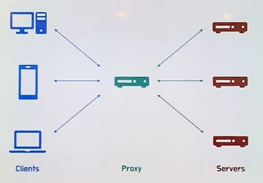
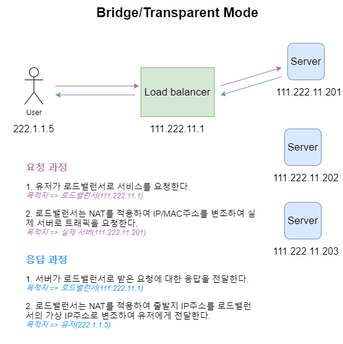

# 프록시

## 프록시 서버

클라이언트와 서버 사이에 위치하는 중계 서버로 통신을 대리 수행하는 서버이다.

- 보안을 위해 서버나 클라이언트를 익명으로 유지할 수 있다.
- IP 주소를 추적당하지 않고, 보안 및 통제를 뚫고 나가기 위해 사용된다
- 캐싱을 통해 자원에 빠르게 접근할 수 있다.
- 사용률을 기록하고 검사하기 위해 사용된다
- 지역 제한을 우회하기 위해 사용된다

> 프록시 서버의 종류
> 
- 포워드 프록시
- 리버스 프록시

## 포워드 프록시

클라이언트와 인터넷 사이에 위치한 중계 서버이다. (일반적으로 칭하는 프록시 서버는 포워드 프록시 서버를 의미한다)

> 특징
> 
1. `캐싱` : 클라이언트의 request에 대한 서버의 response를 캐싱하는 역할을 한다
    - 불필요한 네트워크 통신을 줄이고, 빠른 응답을 가능하게 함
2. `익명성` : 클라이언트의 request의 발원지를 감추는 역할을 한다.
    - request에 클라이언트의 IP주소, OS 정보 등이 담겨 있는데 프록시 서버를 거치면 출발지 IP 주소가 포워드 프록시 서버의 IP주소로 변환된다.

## 리버스 프록시

인터넷과 서버 사이에 위치한 중계 서버이다

> 특징
> 
1. `캐싱` : 클라이언트의 request를 캐싱, 정적 컨텐츠 파일을 캐싱하여 성능향상에 기여
2. `보안` : 서버의 정보를 클라이언트로부터 숨김
    - 서버로 직접 접근하는 것을 막기 위해 `DMZ 네트워크`에 리버스 프록시를 구성한다
        - 실제 서버는 내부망에 위치시키고, DMZ에 리버스 프록시 서버를 위치시킨다.
        - DMS : 내부 네트워크와 외부 네트워크 사이에 위치한 네트워크
3. `로드 밸런싱` : 클라이언트의 request를 여러 서버에 분산시켜준다
4. `무중단 서비스` : 하나의 서버에 장애가 발생하면, 다른 서버에 request를 전달하여 무중단 서비스를 제공해준다
5. `필터링` : 악의적인 request를 필터링한다

## 로드 밸런서

여러 대의 서버에 클라이언트의 요청을 분산시켜주는 서비스이다.

- 서버의 Scaling up에는 한계가 존재한다.
- 서버의 Scaling out과 로드 밸런서를 통해 부하를 분산시켜 원활한 서비스를 제공한다

> 동작 방식
> 

`클라이언트 → 로드 밸런서 → 웹 서버`

1. 클라이언트의 request가 로드 밸런서로 간다
2. 로드 밸런서는 NAT을 통해 request의 목적지 IP/MAC 주소를 서비스를 제공할 웹 서버의 것으로 변환한다.

`클라이언트 ← 로드 밸런서 ← 웹 서버`

1. 웹 서버의 response가 로드 밸런서로 간다
2. 로드 밸런서는 NAT를 적용하여 response의 출발지 IP 주소를 로드 밸런서의 가상 IP 주로소 변환하여 클라이언트에게 전달한다

> 종류
> 

로드밸런서의 종류는 프로토콜 스택을 기준으로 나누어져 있다

1. `L2` : MAC 주소를 바탕으로 로드 밸런싱 한다
2. `L3` : IP 주소를 바탕으로 로드 밸런싱 한다
3. `L4` : 전송 계층 레벨에서 로드 밸런싱 한다. (IP주소와 Port 번호를 바탕으로)
4. `L7` : 응용 계층 레벨에서 로드 밸런싱 한다. (request의 url이나 query param을 바탕으로)

