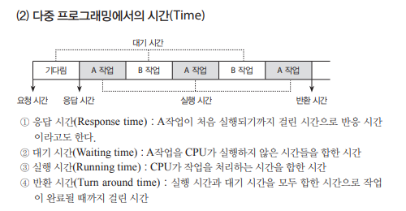

# CPU 스케쥴링

## CPU Burst, IO Burst

`CPU Burst`란 사용자 프로세스가 CPU 제어권을 가지고 명령어를 수행하는 단계이다.

`IO Burst` 란 커널의 도움으로 입출력 작업을 진행하는 단계이다.

## CPU Bound Process, IO Bound Process

`CPU bound process` : CPU만 오랫동안 사용하는 프로세스 (few very long CPU bursts)

`IO bound process` : CPU를 짧게 사용하고 중간에 IO 작업이 많은 프로세스 (many short CPU bursts)

CPU와 IO bound process가 동일한 시스템에서 함께 실행된다. 이와 같은 환경에서 CPU를 효율적으로 사용하기 위해 `CPU 스케쥴링`이 필요하다.

## CPU 스케쥴러

Ready 상태의 프로세스들 중 CPU 제어권을 할당해줄 프로세스를 고르는 운영체제의 코드 부분이다.

> CPU 스케쥴링이 필요한 경우
> 
1. `Running → Blocked` (비선점)
    
    프로세스가 IO 작업과 같이 오래걸리는 작업을 할 경우, CPU 제어권을 반납한다. → CPU 제어권을 할당할 다른 프로세스를 선택해야 한다.
    
2. `Running → Ready` (선점)
    
    CPU 할당 시간이 만료되어 timer interrupt가 발생하여 CPU 제어권을 빼앗긴다.
    
3. `Blocked → Ready` (선점)
    
    IO 작업이 종료된 프로세스는 Ready Queue에서 CPU 제어권을 얻기 위해 대기한다. (우선순위로 CPU 제어권을 얻는 경우, IO 작업이 끝난 프로세스의 우선순위가 가장 높다면 CPU 제어권이 넘어간다)
    
4. `Terminate` (비선점)
    
    CPU 제어권을 가진 프로세스가 종료된다
    

> Dispatcher
> 

CPU 스케쥴러에 의해 선택된 프로세스에게 CPU 제어권을 넘겨주는 역할을 하는 운영체제 커널 코드이다.

- `Context Switch` : Dispatcher가 CPU 스케쥴러가 선택한 프로세스에게 CPU 제어권을 넘기는 과정
- `Dispatcher Latency` : Dispatcher가 하나의 프로세스를 정지시키고 다른 프로세스에게 CPU 제어권을 넘기기까지 걸리는 시간 (Context Switch Overhead)

## CPU 스케쥴링 성능 평가 척도

> 시스템 입장에서의 CPU 스케쥴링 성능 척도
> 

CPU 하나로 최대한 많은 작업을 수행하는 스케쥴링이 좋다고 판단

1. `CPU Utilization(이용률)` : 프로세스 전체 시간에서 CPU가 일을 한 시간의 비율
2. `Throughput(처리량)` : 주어진 시간동안 CPU가 처리한 작업의 수

> 프로세스 입장에서의 CPU 스케쥴링 성능 척도
> 

CPU 제어권을 빨리 얻게 해주는 스케쥴링이 좋다고 판단

1. `Turnaround Time(반환 시간)` : Ready Queue에서 대기한 시간 + 실제로 CPU를 사용한 시간
2. `Waiting Time(대기 시간)` : Ready Queue에서 CPU를 얻기 위해 대기한 시간의 **합**
3. `Response Time(응답 시간)` : Ready Queue에서 **최초로** CPU 제어권을 얻기까지 기다린 시간 (대화형 시스템에 적합한 성능 척도)

## CPU 스케쥴링 알고리즘

| 비선점 스케쥴링 | 선점 스케쥴링 |
| --- | --- |
| FCFS(First-Come First-Service) | RR(Round Robin) |
| SJF(Shortest Job First) | SRT(Shortest Remaining Time, SJF의 선점형 버전) |
| Priority 스케쥴링 | Priority 스케쥴링 |
| HRN(Hightest Responseratio Next) | Multi Level Queue |
|   | Multi Level Feedback Queue |

### `FCFS(First-Come First-Service)`

Ready Queue에 들어온 순서대로 CPU 제어권을 할당하는 스케쥴링

- 비선점 스케쥴링
- 문제점
    - `Convoy Effect 문제` : 처리시간이 긴 프로세스가 먼저 도착하면 처리시간이 짧은 프로세스들이 지나치게 오래 기다리는 현상

### `SJF(Shortest Job First)`

CPU burst가 짧은 프로세스에게 우선적으로 CPU 제어권을 할당하는 스케쥴링

- 비선점 스케쥴링
- FCFS의 Convoy Effect 문제를 해결한다.
- Ready Queue의 전체적인 길이가 짧아지므로 항상 **Minimun Average Waiting Time**을 보장한다(= 항상 최적의 **Turnaround Time**을 보장한다)
- 문제점
    - `Starvation 문제` : CPU burst가 짧은 프로세스가 Ready Queue에 계속 들어오면 CPU burst가 긴 프로세스는 영원히 CPU 제어권을 얻지 못하는 문제

### `Priority 스케쥴링`

우선순위가 높은 프로세스에게 우선적으로 CPU 제어권을 할당하는 스케쥴링

- `선점형 Priority 스케쥴링` : 우선순위가 높은 프로세스가 Ready Queue에 도착하면 기존의 프로세스에서 CPU 제어권을 빼앗는다.
- `비선점형 Priority 스케쥴링` : 우선순위가 높은 프로세스가 도착하더라도 기존 프로세스의 CPU burst가 종료될 때까지 기다린다.
- SJF는 우선순위가 남은 CPU burst인 Priority 스케쥴링의 일종이다
- 문제점
    - `Starvation 문제` : 우선순위가 높은 프로세스가 계속 Ready Queue에 도착하면 우선순위가 낮은 프로세스는 영원히 CPU 제어권을 얻지 못하는 문제
- Starvation 문제 해결법 ([참고](https://itwiki.kr/w/%EC%97%90%EC%9D%B4%EC%A7%95_%EA%B8%B0%EB%B2%95))
    - `Aging 기법` : 프로세스에 나이(age)를 부여하여 이를 우선순위에 반영한다.
        
        CPU를 할당받지 못하고 기다리는 동안 나이를 증가시켜 우선순위가 낮은 프로세스의 Starvation 문제를 방지한다.
        

### `SRT(Shortest Remaining Time, SJF의 선점형 버전)`

**남은 CPU Burst 시간**이 짧은 프로세스에게 CPU 제어권을 우선적으로 할당

- 선점 스케쥴링 (SJF의 선점 버전)
- 문제점
    - **`프로세스의 CPU Burst 시간을 정확히 파악하지 못하는 문제`** : 실행중인 프로세스의 남은 CPU burst 시간보다 짧은 프로세스가 Ready Queue에 들어오면 CPU 제어권을 빼앗긴다. 따라서 CPU 제어권을 가진 프로세스가 현재 얼마만큼 동안 CPU를 사용할 지 알 수 없다.

### `RR(Round Robin)`

프로세스마다 동일한 크기의 CPU 할당 시간(time quantum)을 가지고, 할당 시간이 만료되면 CPU 제어권을 빼앗기고 Ready Queue 맨 뒤에서 대기하는 스케쥴링

- 선점 스케쥴링
- 장점
    - `각 프로세스마다 CPU를 최초로 얻기까지 걸리는 시간(Response Time)이 짧다` : Ready Queue에 `n`개의 프로세스가 있고 할당 시간이 `q`이라면, 모든 프로세스들은 `(n-1)*q` 보다 짧은 응답시간을 갖는다.
- 단점
    - `Turnaround Time(반환 시간)이 길다` :  RR 스케쥴링을 사용하면 모든 프로세스들의 응답시간이 짧아지지만 Ready Queue에서 대기하는 시간이 모두 많아지기 때문이다. (Turnaround Time과 Response Time은 Trade-Off 관계)
- time quantum q에 따른 특징
    - q를 매우 크게 잡으면 → FCFS와 같아진다
    - q를 매우 작게 잡으면 → Context Switch가 많아져 오버헤드가 커진다

### `Multi Level Queue`

여러 프로세스의 특성에 맞는 Ready Queue들을 여러 개 둔다. 이후 Ready Queue마다 우선순위를 매긴다.

- 각각의 Ready Queue마다 독립적인 스케쥴링 알고리즘을 사용한다.
    - 우선순위가 높은 Ready Queue(전위 queue) : 사용자와 상호작용이 잦은 프로세스들이 담긴다 → RR
    - 우선순위가 낮은 Ready Queue(후위 queue) : batch작업과 같이 계산위주의 프로세스들이 담긴다 → FCFS
- 프로세스들은 다른 Queue로 이동할 수 없다 (fixed)
- 문제점
    - `Starvation 문제` : 전위 queue에 담긴 프로세스들에게 우선적으로 CPU 제어권을 할당해준다. 결국 후위 queue에 담긴 프로세스들이 CPU 제어권을 갖니 못하는 문제가 발생한다.
- Starvation 문제 해결법
    - `Time Slice` : 각각의 Ready Queue에 CPU time을 적절한 비율로 할당해준다. (전위 queue : 80%, 후위 queue : 20%)

### `Multi Level Feedback Queue(MLFQ)`

Multi Level Queue에서 **프로세스들이 다른 Queue로 이동할 수 있는** 스케쥴링 기법이다.

- Aging 기법으로 Multi-Level Feedback Queue를 구현할 수 있다.
- MLFQ를 정의하는 요소
    - `큐의 수`
    - `각 큐의 스케줄링 알고리즘`
    - `프로세스를 상위 큐로 승격하는 기준`
    - `프로세스를 하위 큐로 강등하는 기준`
    - `프로세스가 도착했을 때 들어갈 큐를 결정하는 기준`
- MLFQ에 적용되는 규칙
    - `규칙 1 : 우선순위가 높은 프로세스들을 먼저 수행한다.`
    - `규칙 2 : 작업들이 같은 우선순위를 갖는다면 RR로 수행한다.`
    - `규칙 3 : 새로운 프로세스가 시스템에 들어가면 가장 높은 우선순위를 부여한다.`
    - `규칙 4 : 작업은 모든 우선순위에서 주어진 time slice를 모두 사용하면 우선순위가 감소한다.`
    - `규칙 5 : 일정 시간 후 시스템의 모든 작업을 우선순위가 가장 높은 큐로 이동한다. (Priority Boost)`
- 해당 규칙들이 만들어지게 된 계기
    - `규칙1, 규칙2`
        
        우선순위를 변경하지 않으면 High Priority queue에 있는 프로세스가 작업을 모두 완료할 때까지 Low Priority queue에 있는 프로세스들이 스케쥴링 되지 않기 때문
        
    - `규칙3, 규칙4`
        
        설정된 time slice를 모두 사용한 프로세스의 우선순위를 감소시킨다. → 프로세스에게 우선순위를 한번에 설정하지 않고 과거 실행에 따라 우선순위를 바꿔준다.
        
        하지만 1초마다 IO를 수행하는 프로세스A가 있다면, A는 time slice를 다 사용하지 않고 blocked 되기때문에 우선순위가 높게 유지된다. 
        
        A와 같은 프로세스가 많아지면 CPU burst가 긴 프로세스들에게 Starvation 문제가 발생한다. 
        
    - `규칙5`
        
        위와 같은 기아문제와 프로세스 수행중 특성이 변하는 문제를 해결하기 위해 규칙5가 등장했다.
        
        IO를 짧게 자주 수행하는 프로세스의 우선순위가 계속 높게 유지되고, CPU burst가 긴 프로세스의 우선순위가 최하위로 내려간다. 이후 일정시간 뒤에 모든 작업을 우선순위가 가장 높은 queue로 이동시킨다. (Priority Boost) 이로써 Starvation 문제를 해결할 수 있다.
        
    - `규칙4`
        
        할당된 time slice를 모두 사용하지 않고 CPU 제어권을 포기(blocked)하면 우선순위를 그대로 유지하면 스케쥴러를 속일 수 있다. 이 문제를 `Gaming of Our Scheduler` 라 한다.
        
        `모든 우선순위에서 주어진(할당된) time slice를 모두 사용하면 우선순위가 감소`하도록 변경하여 `Gaming of Our Scheduler` 문제를 해결하였다.