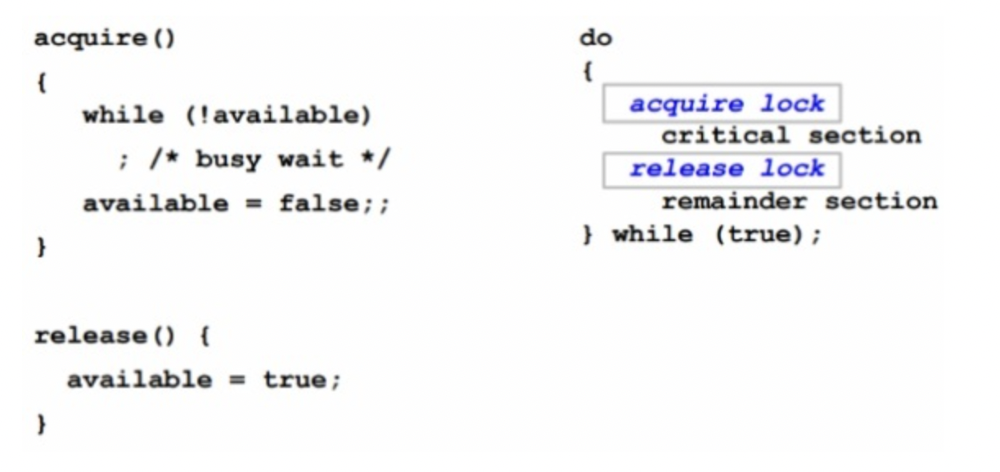
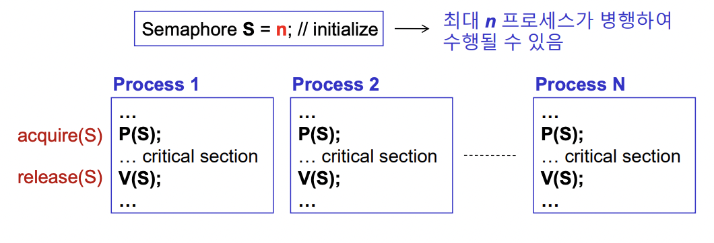
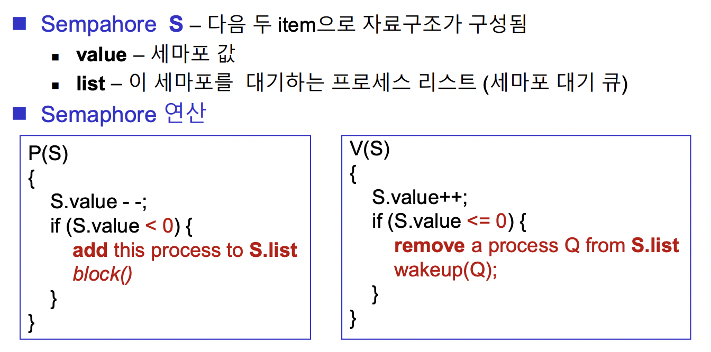
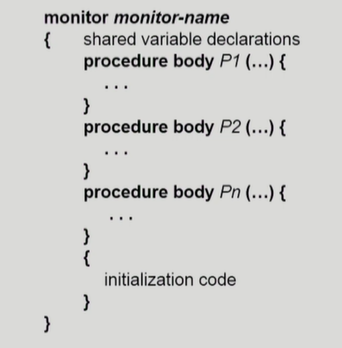

# 프로세스 동기화 (참고 [1](https://www.cs.uic.edu/~jbell/CourseNotes/OperatingSystems/5_Synchronization.html), [2](https://github.com/CS-studi/CS-study/blob/master/CS/Summary/OS/Process_Synchronization.md))

## 프로세스 동기화 문제

여러 프로세스가 하나의 공유 데이터에 접근하여 Race Condition 현상이 발생한다. 이는 결국 데이터 불일치를 야기시킨다.

Race Condition으로 생기는 문제를 막기 위해서 프로세스들 간에 동기화가 이루어져야 한다.

## Race Condition이 발생하는 경우

1. `커널 모드에서 코드를 수행하다가 interrupt가 발생하여 커널 모드에서 다른 코드를 실행하는 경우`
    - interrupt handler도 커널의 코드이기 때문에 interrupt가 발생하면 커널 모드에서 작업이 수행된다.
    - ex) 커널 코드의 공유 변수 count를 +1 하다가 interrupt가 발생하여 interrupt handler가 count 변수를 -1 하는 경우.
    - `해결법` → 커널 코드의 공유 변수에 접근하는 동안 interrupt 처리를 하지 않는다
2. `프로세스가 커널 모드에서 커널 코드를 실행하는 도중에 Context Switch가 발생하는 경우`
    - ex) 프로세스 A가 커널 모드에서 커널 코드의 공유 변수 count를 +1 하는 도중 Context Switch 가 발생 → 프로세스 B가 다시 커널 모드에서 count 변수를 -1을 하는 경우
    - `해결법` → 프로세스가 커널 모드에서 작업을 수행중이라면 CPU 할당 시간이 만료되어도 커널 모드에서 작업이 끝날 때까지 Context Switch하지 않는다
3. `멀티 프로세서 환경`
    - CPU가 여러 개 있는 환경이기 때문에 1,2번의 해결법으로 해결하지 못한다.
    - `해결법` → 커널 내부의 공유 데이터에 Lock을 건다.
    

## Critical Section(임계 구역)

임계 구역이란 공유 데이터에 접근하는 코드 영역이다. 각 프로세스의 code segment에 임계 구역이 존재한다.

> 임계 구역 문제를 해결하기 위해 만족해야하는 조건
> 
1. `상호 배제(Mutual Exclusion)` : 어떤 프로세스가 임계 구역에서 코드를 수행중이라면 다른 프로세스들은 해당 임계 구역에 들어갈 수 없다
2. `진행(Progress)` : 임계 구역에서 작업을 수행중인 프로세스가 없을 때, 임계 구역에 들어가고자 하는 프로세스가 있으면 들어갈 수 있어야 한다
3. `유한 대기(Bounded Watiting)` : 특정 프로세스가 임계 구역에 들어가려고 요청하면, 그 요청이 허용될 때까지 다른 프로세스들의 임계 구역 출입 횟수에 제한이 있어야 한다. (starvation을 막기 위함)

## Critical Section 문제 해결법

```java
1. 데커 알고리즘 (turn, flag[i])
2. 피터슨 알고리즘 (turn & flag[i])

/* 하드웨어적인 방식 */
1. Test_and_Set

/* 소프트웨어적인 방식 */
1. Mutex Locks
2. Semaphore
3. Monitor
```

### `Test_and_Set(x)`

CPU가 Read와 Write 연산을 하나의 명령어로 수행하지 못하기 때문에 대부분의 동기화 문제가 발생한다. **Test_and_Set 명령어를 통해 Read & Write 연산을 atomic하게 수행하여 동기화 문제를 해결할 수 있다.**

### `Mutex Locks`



- `Locking 메커니즘`: 프로세스는 mutex를 얻어 임계 구역에 들어갈 수 있고, mutex lock을 건 프로세스만이 mutex를 unlock할 수 있다.
- `Busy Waiting(Spin Lock)` : 임계 구역에 들어가기 위해서 계속 aquire() 속 while 문이 실행되는 현상
    - 임계 구역에 들어가기 위해 mutex lock이 unlock될 때까지 CPU를 낭비한다.
    - 임계 구역의 길이가 짧은 경우 적합하다
- `Block & Wakeup` : 권한을 얻기 위해 기다리는 스레드를 Sleep시켜 Waiting Queue에 담고 다른 스레드에게 CPU를 양보한다. 권한 이벤트가 발생하면 Waiting Queue에 담긴 스레드를 깨워 CPU를 부여한다.
    - 임계 구역의 길이가 긴 경우 적합하다
    - 단점 : 스레드를 Waiting Queue에 넣는 자원 비용 + Context Switching 비용
- `Test_and_Set` : Busy Waiting 문제가 없는 Mutex Lock
    - lock을 획득하지 못한 프로세스는 CPU 제어권을 반환하고 대기상태로 전환된다.

### `Semaphore`


세마포어는 사용할 수 있는 공유 자원의 개수를 나타내는 변수이다.

- 세마포어 연산
    - `P(S) 연산` : wait(S), acquire(S)
    - `V(S) 연산` : signal(S), release(S)
- `Signaling 매커니즘` : lock을 걸지 않은 스레드도 Signal을 보내 lock을 해제(=세마포어 변수 +1)할 수 있다.
- `Deadlock 문제` : P(S), V(S) 연산의 순서를 바꿔서 실행하거나 하나라도 생략하면 상호배제가 깨지거나 데드락이 발생할 수 있다.
- `Starvation 문제` : Waiting Queue에서 깨울 스레드를 선택하는 알고리즘이 LIFO라면 먼저 잠든 스레드는 영원히 깨어나지 못한다.

> `Binary Semaphore`
> 

상호 배제 → Binary Semaphore


세마포어 변수 : 0 또는 1의 값을 갖는다.

- 임계 구역 접근 제어에 Binary Semaphore가 사용된다.

> `Counting Semaphore`
> 

유한 개수의 공유 자원 → Counting Semaphore



세마포어 변수 : 가용 자원의 개수 만큼의 정수 값을 가진다.

- 유한 개수의 자원 접근 제어에 Counting Semaphore가 사용된다.
- Busy Waiting 문제가 있다.


1. P2가 임계 구역 코드를 수행중이다.
2. P1이 임계 구역에 들어가려 한다. 하지만 세마포어 변수가 0이므로 P(S) 연산을 수행한다. (P(S) = wait(S) : CPU 제어권을 반환하고 Waiting Queue에서 대기)
3. P2가 임계 구역에서 나와 V(S) 연산을 수행하여 세마포어 변수가 +1 된다. (V(S) = signal(S)) 
4. Waiting Queue에 대기중인 P1이 깨어나 세마포어 변수를 -1 하여 임계 구역에 들어간다.

> Busy Waiting이 없는 Semaphore 구현
> 



- Block & Wakeup 방식 (sleep lock)
- 임계 구역에 들어가고자할 때 P(S) 연산을 수행한다. 이때 세마포어 변수를 먼저 감소시킨다.
    - 음수 세마포어의 크기 = 임계구역에 들어가기 위해 Waiting Queue에서 대기 중인 프로세스 수
- P(S), V(S) 연산은 atomic하게 수행되어야 한다.

### `Monitor`



프로그래밍 언어 차원에서 동기화 문제를 해결하는 고수준의 동기화 추상화 데이터형이다.

- 모니터를 사용하므로써 세마포어의 단점(P(S), V(S) 연산의 순서 오류)을 극복할 수 있다.
- 모니터 내부에 `공유 데이터(shared data)`와 이에 접근하기 위한 `연산(operations = procedures)`들을 정의해두어야 한다. 정의해둔 연산으로만 공유 데이터에 접근할 수 있다.
- 모니터는 원척적으로 내부의 procedure들이 동시에 실행되지 않도록 통제하기 때문에 프로그래머가 직접 Lock을 걸 필요가 없다 (Java의 synchronized, volatile 키워드)


프로세스가 monitor 안에서 기다릴 수 있도록 `조건 변수(Condition Variable)`를 사용할 수 있다.

- 조건 변수는 wait()와 signal() 연산에 의해서만 접근 가능하다.
    - `x.watit()` 을 호출한 프로세스는 다른 프로세스가 `x.signal()` 을 호출하기 전까지 suspend된다).
    - `x.signal()` 은 정확하게 하나의 suspended된 프로세스를 깨운다. 만약 suspended된 프로세스가 없으면 아무 일도 일어나지 않는다.