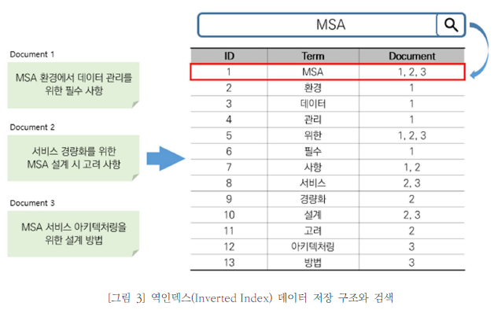

# Elasticsearch

## Elasticsearch(ES)


> ES는 프로그램으로서의 검색 엔진이다.
> 
- 검색 시스템은 `수집기, 저장소(DB), 색인기, 검색기, UI`로 구성되어 있다.
- ES는 검색 시스템에서 `저장소, 색인기, 검색기`의 기능을 수행한다
    - 저장소 : 수집기가 크롤링한 데이터를 저장하는 공간
    - 색인기 : 수집한 데이터를 역색인이라는 색인 과정을 거쳐 검색에 용이한 데이터로 만든다
    - 검색기 : 색인된 단어를 검색하여 적절한 결과를 추출해준다.

### `색인기`

> 색인과 역색인(Inverted-Index)
> 


`색인` : 검색 속도를 빠르게 하기 위해 특정 데이터의 위치를 저장해두는 기법

- 국어사전에서 단어 순의 첫번째 단어마다 갈피를 만드는 과정이 색인이다. (데이터의 위치를 순서대로 기억)


`역색인` : 데이터 색인시 단어를 기준으로 색인을 수행하는 기법

- 단어가 등장한 문서의 위치를 저장해둔다.
- 역색인 기법을 사용하면 단어가 등장하는 게시글을 빠르게 찾을 수 있다. (Elasticsearch는 빠른 검색을 위해 역색인 기법을 사용)

### `검색기`

> 형태소 분석
> 

검색하는 문장 속 단어의 형태소를 분석한다.

```java
검색 (명사)
잘하는 (형용사)
방법 (명사)
```

- 검색엔진은 역색인을 보고 “검색” 이라는 단어가 등장하는 게시글을 찾을 수 있다.

> TF-IDF → 검색의 품질을 높힌다
> 

`TF(Term Frequency)` : 용어의 빈도수(문서 내부에 특정 단어가 등장한 빈도수)

`IDF(Inverse Document Frequency)` : 흔치 않은 단어의 빈도수(특이한 단어가 등장한 빈도수)

`TF-IDF` ⇒ 사용자의 검색어가 자주 등장하는 document가 있을 때, 해당 사용자의 검색어는 해당 document와 연관도(TF-IDF)가 높다고 말한다.

### ES는 프로그램으로서의 검색 엔진으로 `역색인 기법`과 `형태소 분석`을 통해 빠른 검색 속도를 제공한다.

## ES의 장단점

> ES의 장점
> 
- `검색어를 여러 단어로 변형(동의어, 유의어)하여도 형태소 분석을 통해 적절한 결과를 제공한다.`
- `RDBMS에서 불가능한 비정형 데이터의 색인 및 검색을 지원한다.`
- `역색인을 통한 빠른 검색을 지원한다.`
- `NoSQL 데이터베이스의 역할을 수행한다`
- `REST API로 데이터에 대한 CRUD 연산이 가능하다`

> ES의 단점
> 
- `실시간 처리가 불가능하다`
    - commit, flush 연산을 거쳐 데이터를 색인하기 때문에 1초 뒤에나 색인된 데이터를 검색할 수 있다.
- `트랜잭션, 롤백 등의 데이터 일관성을 위한 기능이 없다`
    - 분산 시스템의 특징이다. 결국 데이터 유실 및 관리에 유의해야 한다
- `진정한 의미의 UPDATE를 지원하지 않는다.`
    - ES는 document를 삭제할 때 삭제할 document에 delete tag를 붙히고 새로운 document로 대체한다.
    - segment merge가 일어날 때 delete tag가 붙은 document가 삭제된다. segment가 많아지면 merge 시간이 늘어나고, merge 전까지 delete tag가 붙은 document를 검색범위에서 제외하는 연산이 추가되어야 한다.

## ES vs RDBMS

> RDBMS와 ES의 데이터 저장 방식 차이
> 


`RDMBS는 데이터(문장)를 행에 저장하여 행을 기준으로 탐색한다.`

- 저장된 데이터가 많을 수록 탐색해야 할 데이터가 많아지기 때문에 검색 속도가 느려진다.



`ES는 데이터(문장)를 역색인하여 단어로 저장하기 때문에 역색인을 기준으로 탐색한다.`

- 문장을 역색인하여 단어와 해당 단어가 등장하는 document를 저장한다.
- 문장을 기준으로 모든 document를 탐색할 필요 없다. document의 개수와 상관없이 키워드로 빠르게 검색할 수 있다.
- 다만 ES에서 데이터 수정 및 삭제에 많은 리소스가 소모되기 때문에 데이터 특성에 따라 ES와 RDBMS로 나누어 저장하는게 바람직하다

> ES와 RDBMS 용어 차이
> 


| ES | RDBMS |
| --- | --- |
| Index | 데이터베이스(Database) |
| Type | 테이블(Table) |
| Document | 행(Row) |
| Field | 열(Column) |
| Mapping | 스키마(Schema) |
| Shard | 파티션(Partition) |
| Query DSL | SQL |

## ES의 구조


ES는 분산 시스템 구조이며 여러 개의 Node로 이루어져있다. 각 Node는 Index(RDB의 데이터베이스)으로 이루어져있다. 각 Index는 Shard로 구분된다. Shard에는 원본 데이터가 저장되는 Primary Shard와 복제 데이터가 저장되는 Replica Shard가 있다.

### `Node`

1. `Master Node` : cluster를 관리하는 노드이다.
    - 노드 추가 및 제거, 인덱스 생성 및 삭제 작업을 수행한다
    - 네트워크 속도가 빠른 노드를 master 노드로 설정하는게 권장된다.
2. `Data Node` : 데이터(document)가 저장되는 노드이다.
    - shard가 배치되는 노드이다.
    - 색인 작업이 수행되는 곳이다
3. `Coordinating Node` : 사용자의 요청을 분기처리 해주는 노드이다.
    - cluster에 관련된 요청은 master node로, 데이터에 관련된 요청은 data node로 분기처리 해준다 (Round Robin 방식을 사용)
4. `Ingest Node` : document의 전처리 작업을 수행하는 노드이다.


### `Document`

```java
// 간단한 JSON 데이터의 예제입니다.
{
	"name": "현준",
    "job": "Programmer",
    "schools": {
    	"elementary_school": "one in Nowon",
      "middle_school": ["one in Nowon", "one in Nowon"]
      "high_school": "one in Nowon",
    }
}
```

ES 데이터의 최소 단위이다. (RDB에서 Table의 Row에 해당한다)

- JSON object 하나를 의미한다
- 하나의 document는 다양한 field로 구성되어 있다.
- filed에는 적절한 타입의 데이터가 들어간다
- document 내부에 또다른 document가 들어갈 수 있다. (document 중첩 구조)

### `Index`

document를 모아둔 집합이다. (RDB에서 database에 해당한다)

- 하나의 index는 하나의 type만 존재한다. (type은 RDB의 Table에 해당)
- 데이터를 저장 및 색인하는 곳이다.

multi-tenancy

- ES는 각각의 index마다 connection을 생성할 필요가 없다. (RDB에서는 하나의 database에 대한 connection을 생성한 뒤에 한번에 하나의 쿼리를 날려야 한다)
- 데이터를 여러 index에서 동시에 조회할 수 있다.

분산 저장

- ES를 분산 환경으로 구성하면 index가 여러 node에 분산되어 저장된다.

schemaless 기능

- index가 존재하지 않는 상태에서 특정 index에 document를 저장할 수 있다. (document를 저장하면 index가 자동으로 생성됨) 이러한 기능을 `schemaless 기능`이라고 한다.
- schemaless로 데이터를 색인할 경우 standard analyzer라는 기본 분석기를 사용한다. 이는 한글에 부적합한 분석기라서 띄어쓰기 기준으로 적절한 형태소 분석이 이루어지지 않는다.

### `Shard`

index가 분리되는 단위이다 (RDB에서는 Partition에 해당한다)

- shard는 논리적/물리적으로 분할된 index이다
    - shard는 원본 색인 데이터인 primary shard와 복제본인 replica shard로 구분한다.
- shard는 es에서 사용하는 Lucine(검색엔진)의 인스턴스이다.

### `Lucine Index`

Lucine 라이브러리를 갖는 각 shard의 최소 단위 검색 모듈이다.

- shard와 Lucine index는 1대1 관계이다.
    - shard 내부의 Lucine 라이브러리는 여러 클래스를 활용하여 CRUD나 검색 작업을 수행한다.
- Lucine은 새로운 document를 index에 저장할 때 segment를 생성한다.

### `Segment` ([참고](https://coding-start.tistory.com/176))

shard의 데이터(색인 데이터)를 가지고 있는 물리적인 파일이다.

- Lucine(검색엔진)에 데이터가 색인되면 해당 데이터는 토큰 단위로 분리되고 segment 단위로 저장된다.
    - segment는 읽기 연산에 최적화된 역색인 형태로 변환되어 물리적 disk에 저장된다.
- document들을 빠르게 검색할 수 있도록 설계된 특수한 자료구조이다. → 역색인 데이터이다.
    - shard에 대한 검색 요청을 여러 segment로 분산 처리할 수 있다. → 각 segment를 탐색한 결과를 조합하여 해당 shard의 검색 요청에 대한 결과로 반환한다 (효율적인 검색이 가능)
- 하나의 shard는 여러 segment로 구성된다.

`flush → commit → segment merge`

- `flush`
    - 매번 검색 요청마다 새로운 segment를 만들면 너무 많은 segment가 생성된다. → 다른 검색 요청에 지장
    - 인메모리 버퍼에 데이터를 저장해두다 가득 차면 flush 작업이 진행된다. 이후 segment가 생성되고 비로소 데이터 검색이 가능해진다.
- `commit`
    - segment는 일정 시간이 지난 뒤에 물리적 disk에 저장된다
- `segment merge`
    - disk에 저장된 segment는 시간이 지남에 따라 여러 segment가 하나의 segment로 병합되는segment merge 과정이 이뤄진다.
    - segment merge 작업은 새로 만들 segment 에 대한 여유 공간이 필요하고, 시스템 자원을 많이 소모하는 작업이므로 여유로울 때 진행된다.

[참고](https://www.elastic.co/guide/en/elasticsearch/guide/current/near-real-time.html)

> ES -> Filesystem Buffer -> Disk
> 

es와 disk 중간에 filesystem buffer(인메모리 버퍼)가 존재한다.

1. document를 가지고 있는 lucine index가 인메모리 버퍼에 먼저 쓰여지고 (리소스 소모가 적음)
2. 버퍼가 가득차 flush가 이뤄질 때 메모리 상에 segment로 생성된다.
3. 이 후 commit 이 이뤄지면 메모리상의 segment가 disk에 저장된다. (리소스 소모가 큼)

> segment의 검색 가능 시점 (우리가 가졌던 의문)
> 
1. disk에 저장된 segment만 검색가능할까?
2. disk에 저장되기 전 메모리에 있는 segment도 검색 가능할까?

**답 : disk에 있는 segment 뿐만 아니라 메모리에 있는 segment도 검색이 가능하다.** (The buffer contents have been written to a segment, which is searchable, but is not yet commited)

> commit이 왜 성능저하를 일으킬까?
> 

`Commiting a new segment to disk requires an [fsync](http://en.wikipedia.org/wiki/Fsync) to ensure that the segment is physically written to disk and that data will not be lost if there is a power failure.`

메모리 상의 segment를 disk에 저장하는 commit 작업은 `fsync` 로 수행되고 `fsync` 작업의 비용이 매우 크다.따라서 `fsync` 를 덜 수행하면서 검색 결과를 제공하는 방법이 필요하다.

> 굳이 메모리에 있는 segment를 검색 가능하게 만드는 이유가 뭘까?
> 

잦은 commit으로 인한 성능저하를 막고 검색 결과를 빨리 제공하기 위함이다.(메모리에 있는 segment는 검색 가능하게 하는 작업이 disk에 쓰는 commit 작업보다 리소스 소모가 적다.)

immutable

- segment는 불변의 성질을 가지고 있어서 데이터를 update할 경우 마킹만 해두고 새로운 데이터를 가리킨다.
- 삭제 마킹된 데이터는 disk에 남아있다가 백그라운드에서 주기적으로 새로운 segment로 merge된다.(segment merge 과정)
    - merge된 segment는 disk에서 완전히 삭제된다