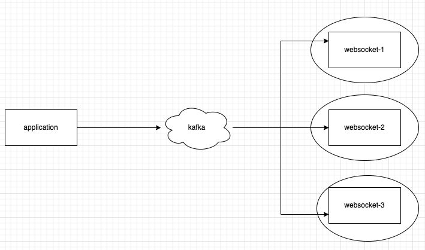

# Object의 equals(), hashCode() 메소드



## equals()

<figure><figcaption><p>Object.java</p></figcaption></figure>

> Note that it is generally necessary to override the hashCode method whenever this method is overridden, so as to maintain the general contract for the hashCode method, which states that equal objects must have equal hash codes.

Object 클래스는 배열을 포함한 자바의 모든 클래스의 super 클래스이다. 이때, Object의 equals()는 클래스 객체의 참조값에 대한 동등성을 판단하는 메소드이다. <mark style="background-color:yellow;">**만약 클래스에서 equals() 메소드를 재정의할 경우, hashCode() 메소드도 함께 재정의해야한다. equals() 로 동일하다 여겨지는 두 객체는 hashCode() 값 또한 동일해야하기 때문이다.**</mark>

equals() 메소드를 통해 동등성(`equality`) 비교를 할  수 있다. 동등성 비교란 객체의 주소값이 아닌 표현 데이터가 동일한지 비교하는 것이다. 비슷한 개념으로 동일성(`==`) 비교라는 개념이 존재한다. 이는   객체의 주소값을 비교하는 것이다.

## hashCode()

<figure><figcaption><p>Object.java</p></figcaption></figure>

> Returns a hash code value for the object. This method is supported for the benefit of hash tables such as those provided by java.util.HashMap.

hashCode()란 객체의 해시코드 값을 반환한다. 이 메소드를 통해 Hash Table의 성능상 이점을 제공한다. 다시말해, hashCode() 메소드를 올바르게 재정의하지 않는다면 HashMap 등과 같은 Hash Collection의 성능이 떨어진다.

> As much as is reasonably practical, the hashCode method defined by class Object does return distinct integers for distinct objects. (The hashCode may or may not be implemented as some function of an object's memory address at some point in time.)

Object의 hashCode는 객체마다 유일한 해시코드값을 반환한다. `x.equals(y) == true` 라면 x,y의 hashCode값이 같아야 한다.

`x.equals(y) == false` 이어도 x,y의 hashCode값이 같을 수 있다. 하지만 Hash Table의 성능을 향상시키기 위해선  서로 다른 고유한 값을 반환하도록 hashCode 메소드를 정의해야 한다.




<figure><figcaption><p>System.java</p></figcaption></figure>

System.identityHashCode()는 특정 클래스에서 hashCode()가 재정의되어있더라도 Object의 hashCode()으로 해시 코드 값을 반환하는 메소드이다. `System.identityHashCode(null) == 0` 이다.



```java
@Target({ElementType.METHOD, ElementType.CONSTRUCTOR})
@Retention(RetentionPolicy.RUNTIME)
public @interface HotSpotIntrinsicCandidate {
}
```

HotSpotIntrinsicCandidate 어노테이션은 HotSpot VM에만 적용된다. 해당 어노테이션이 달린 메소드를 어셈블리 및 컴파일러 IR로 대체하므로써 성능을 개선한다.




### 해시 충돌

객체의 hashCode 값을 구할 때, 아무리 효율적인 해싱 알고리즘을 사용하더라도 주소값이 서로 다른 객체가 동일한 hashCode 값을 가질 수 밖에 없다.&#x20;

`public native int hashCode();` 에서 볼 수 있듯이 hashCode()의 반환값이 int 형이이므로 표현할 수 있는 해시 코드 값이 제한되어 있기 때문에 해시 충돌이 날 수 밖에 없는 구조이다.

###

### 해시 충돌 해결 방안

hashCode가 동일하지만 unequal한 두 객체는 같은 bucket index를 head로 가지는 linkedList에 추가된다. 만약 객체의 hashCode() 메소드를 비효율적으로 재정의하여 해시 충돌 빈도가 높아진다면, 특정 버킷의 linkedList에 원소가 많아지게 된다. 결국 객체를 비교할 때 최악의 경우 O(N)의 시간복잡도를 갖게 된다. (HashMap의 최선의 경우 시간복잡도는 O(1)이다)

java8 부터 HashMap의 성능을 높히기 위해 하나의 bucket의 linkedList의 원소가 특정 개수를 넘어서면 red-black tree로 변환한다. 이를 통해 최악의 경우의 시간복잡도를 O(N)에서 O(logN)으로 제한을 둘 수 있게 되었다. (red-black tree는 최악, 최선의 경우 시간복잡도가 O(logN)이다)

