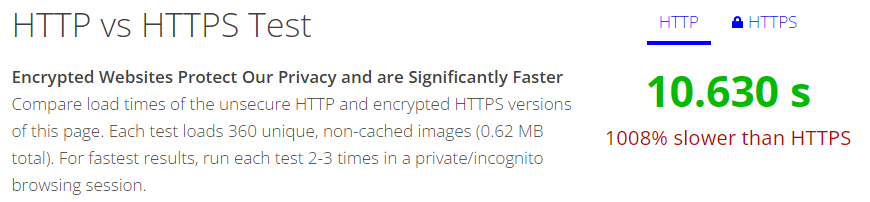

# HTTP & HTTPS

## HTTP의 문제점

1. `TCP/IP 는 도청이 가능한 네트워크이다.`
    
    HTTP는 TCP/IP 기반의 통신 프로토콜이다. TCP/IP는 데이터를 평문으로 주고받는 네트워크이기 때문에 통신 경로상의 패킷을 수집하는 것만으로도 수동적 도청이 될 수 있다
    
    해결방안
    
    - SSL또는 TLS 계층으로 통신 자체를 암호화하여 해결할 수 있다.
    - HTTP 메시지에 포함된 내용만 암호화하여 해결할 수 있다. (데이터를 전달받은 측에서 복호화처리가 필요)
2. `HTTP는 통신 상대를 확인하지 못한다`
    
    HTTP 통신은 현재 request를 보낸 상대를 식별하지 못하기 때문에 위장에 취약하다.
    
    - request를 보낸 상대가 접근이 허가된 상대인지 확인할 수 없다
    - 서버는 의미 없는 request에도 response를 보내야 하기 때문에 DoS 공격에 취약하다
    
    해결방안
    
    - SSL을 사용한다.
        
        SSL은 클라이언트를 확인하고 서버의 안전성을 나타내는 수단으로 CA 인증서를 사용한다. 
        
        - CA 인증서로 서버에게 클라이언트의 실재함을 증명할 수 있다.
        - CA 인증서로 클라이언트에게 서버의 안전성을 나타낼 수 있다
3. `정보의 완전성을 증명할 수 없다`
    
    완전성이란 정보의 정확성(수신한 데이터가 송신측에서 보낸 원본 데이터와 일치하는 지)을 의미한다.
    
    - HTTP는 정보의 완전성을 증명하지 못하기 때문에 데이터가 변조되었는지 확인할 수 없다 (중간자 공격에 취약하다)
    
    해결방안
    
    - SSL을 사용한다.
        
        인증, 암호화, Digest 기능을 제공하는 SSL을 HTTP와 함께 사용해야 한다.
        

## SSL

SSL(Secure Socket Layer)는 웹 사이트와 웹 브라우저 또는 두 서버간의 통신을 암호화하는 계층이다.

- OSI 7계층 ~ 4계층 사이에서 동작하기 때문에 TCP 기반의 모든 어플리케이션에서 SSL이 적용된다
- CA 인증서를 통해 클라이언트와 서버간의 통신을 보증해준다. (서버에게 클라이언트의 실재함을 증명, 클라이언트에게 서버의 안정성을 증명)
- 클라이언트와 서버가 주고받는 데이터는 `대칭키 암호화 방식`으로 암호화한다. 대칭키는 `비대칭키 암호화 방식`으로 전달된다.

## HTTPS

HTTP 프로토콜의 소켓 통신 계층을 SSL/TLS으로 대체한 프로토콜이다

- `HTTPS ⇆ SSL ⇆ TCP` : HTTP는 TCP와 직접 통신하지만, HTTPS는 SSL를 거쳐 TCP와 통신한다.

## HTTPS 를 사용해야하는 이유

- `기밀성을 보장하는 통신 프로토콜이다`
    - 공공 매체에서 두 사용자 간의 통신을 보호한다
- `무결성을 보장하는 통신 프로토콜이다`
    - SSL의 암호화 방식으로 정보의 변조를 방지한다
- `인증이 가능한 통신 프로토콜이다`
    - CA 인증서를 통해 클라이언트의 실재함을 서버의 안정성을 확인할 수 있다
- `HTTPS를 사용하는 사이트는 검색 엔진 최적화(SEO)가 된다`
    - 대표적인 검색 엔진(구글, 네이버)에서 동일 키워드를 포함한 사이트들 가운데 HTTPS 기반의 사이트를 상위 노출해준다
- `AMP(가속화된 모바일 페이지)를 사용하기 위해서 HTTPS를 사용해야 한다`
    - 구글이 개발한 AMP(Accelerate Mobile Pages)는 모바일 기기에서 HTML의 불필요한 부분을 없애 빠른 로딩을 가능하게 하는 기술이다.
- `HTTP/2.0에서는 HTTP보다 HTTPS가 빠르다` ([참고](https://www.httpvshttps.com/), [참고2](https://tech.ssut.me/https-is-faster-than-http/))
    - 사실 HTTP보다 HTTPS가 느린것은 당연하다. 중간에 핸드셰이크와 데이터 암복호화가 이루어져있기 때문이다.
    - 하지만 HTTP/2.0은 멀티 플렉싱, 동시 처리, 헤더 압축, server push 및 stream dependency의 기능을 수행할 수 있기 때문에 ...
    
    
    
    