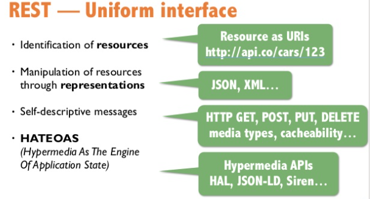

# Rest & RestAPI

## REST

REST(Representational State Transfer)는 웹 상의 시스템들 간에 표준을 제공하여 통신을 쉽게하도록 하는 네트워크 기반의 아키텍쳐이다.

- **“웹에 존재하는 모든 자원(이미지, 동영상, DB 자원)에 고유한 URI를 부여해 활용”** 하는 것으로, 자원을 정의하고 자원에 대한 주소를 지정하는 방법론을 의미한다

## REST의 구성 요소

| 구성 요소 | 내용 | 표현 방법 |
| --- | --- | --- |
| Resource(자원) | 자원(서버에 있는 데이터) | HTTP URI |
| Verb(행위) | 자원에 대한 행위 | HTTP Method |
| Representations(표현) | 자원에 대한 행위의 내용(서버의 응답) | HTTP Message Pay Load |

클라이언트가 HTTP URI로 지정한 데이터에 HTTP Method로 조작 행위를 요청하면, 서버는 HTTP Message로 이에 대한 응답을 한다.

## REST 6원칙

REST의 기본 6원칙을 지키는 것을 RESTful하다고 표현한다.

1. `클라이언트-서버 모델`
    
    서버(데이터 처리 영역)와 클라이언트(사용자 인터페이스)의 역할이 분리되어 있어 독립적으로 교체 및 개발될 수 있다.
    
    - 유지 보수가 매우 쉬워진다
2. `무상태`(stateless)
    
    세션 상태 정보가 서버에 저장되지 않는다. (필요에 따라 외부 DB에 저장하기도 한다.)
    
    - 서버는 클라이언트 요청에 대한 응답만 할 뿐, 세션 관리는 클라이언트에게 책임이 있다
    - 서버에서 세션관리를 하지 않기 때문에 Scaling Out이 자유롭다
3. `캐시 가능`
    
    HTTP 프로토콜이 가진 캐싱 기능을 적용하여 서버의 Response를 캐싱할 수 있다.
    
    - 클라이언트의 동일한 Request에 대해 캐싱된 Response를 재사용할 수 있다.
    - 캐싱을 활용하여 클라이언트와 서버 간의 불필요한 통신을 줄일 수 있다
4. `자체 표현 구조`
    
    REST는 자체 표현 구조(self-descriptiveness)로 구성되어 REST API만으로 요청을 이해할 수 있다.
    
5. `Layered System`
    
    서버는 다계층으로 구성될 수 있다.
    
    - 로드 밸런싱, 암호화 계층을 추가할 수 있고, 게이트웨이와 같은 네트워크 미들웨어를 사용할 수 있다
    - 서버는 내부 계층을 숨기고 클라이언트와 인접한 계층만 공개한다.
    - 클라이언트는 서버의 내부 계층에 대해 모르는 상태에서 API만 호출한다
6. `균일한 인터페이스`(Uniform Interface)
    
    REST 표준을 따르면 플랫폼, 언어, 기술에 종속되지 않고 API를 호출할 수 있다
    
    - Uniform Interface의 4가지 제약조건
        
        
        
        1. `Identification of Resources` → 자원을 URI로 식별
        2. `Manipulation of Resources Through Representations` → 자원 조작의 결과를 JSON 등으로 표현
            
            ```java
            // 이전 방식
            https://my-server.com/page?user=guest/menu=login
            
            // REST API를 적용한 방식
            HTTP Method : GET -> GET이니까 로그인 페이지를 요청하는 것이라 짐작 가능
            https://my-server.com/user/login 
            
            HTTP Method : POST -> POST 요청이니까 로그인이 수행될 것이라 짐작 가능
            https://my-server.com/user/login
            ```
            
            - URI로 지정한 자원을 HTTP Method를 통해 조작한 결과를 JSON,XML 등으로 표현할 수 있다.
            - REST API를 사용하면 짧은 URI로 여러 형태의 표현이 가능해진다
        3. `Self-Descriptive Message`
            
            REST API responsebody에 API 문서가 존재해야한다. 물론 API 문서 전체를 responsebody에 담을 순 없고, 적어도 API 문서의 위치를 알려줘야 한다.
            
            - 서버에서 Response Data를 변경할 경우, 클라이언트는 API 문서를 통해 어떤 필드가 변경되었는지 확인할 수 있다
        4. `HATEOAS(Hypermedia As The Engine of Application State)`
            
            하이퍼미디어(링크)를 통해 어플리케이션이 상태 전이할 수 있도록 해야 한다.
            
            ```json
            // Request
            GET /accounts/12345 HTTP/1.1
            Host: bank.example.com
            
            // Response
            HTTP/1.1 200 OK
            {
                "account": {
                    "account_number": 12345,
                    "balance": {
                        "currency": "usd",
                        "value": 100.00
                    },
                    "links": {
                        "deposits": "/accounts/12345/deposits",
                        "withdrawals": "/accounts/12345/withdrawals",
                        "transfers": "/accounts/12345/transfers",
                        "close-requests": "/accounts/12345/close-requests"
                    }
                }
            }
            ```
            
            - ResponseBody에 상태 전이 될만한 API 링크 리스트를 “links” 필드에 담아줘야 한다.

## REST의 장단점

`장점`

- REST 아키텍쳐는 HTTP 프로토콜을 기반으로 하기 때문에 REST API를 위한 별도의 인프라를 구축할 필요 없다
- HTTP 프로토콜의 추가적인 장점을 취할 수 있는 아키텍쳐이다
- HTTP 프로토콜을 따르는 모든 플랫폼에서 사용할 수 있다.
- 서버와 클라이언트의 역할을 명확하게 분리하기 때문에 유지보수 및 관리가 쉽다

`단점`

- REST 아키텍쳐에 대한 명확한 표준이 존재하지 않다
- HTTP Method의 형태가 제한적이다. 따라서 다양한 세부 기능을 구현하는데 제약이 발생할 수 있다.

## REST를 사용하는 이유

1. `어플리케이션 분리 및 통합`
    
    RESTful API를 통해 서로 다른 모듈 및 어플리케이션간의 상호 통신이 가능해졌다. 이를 통해 거대한 어플리케이션을 모듈 및 기능별로 분리하기 쉬워진다.
    
2. `다양한 클라이언트의 등장`
    
    RESTful API를 사용하면 JSON, XML 등의 데이터만 주고 받기 때문에 클라이언트들이 자유롭게 통신할 수 있다.
    
    - 이전에는 HTML 및 이미지 파일을 응답으로 보냈었다. 모바일 어플리케이션은 response로 파일을 받는 것만으로도 부담이 된다.

## RESTful

REST 아키텍쳐를 따르는 시스템을 RESTful하다 라고 할 수 있다.

- 이해하기 쉽고 사용하기 쉬운 REST API를 만드는 것이 RESTful의 목적이다.
    - 일반적인 컨벤션을 통해 API의 이해도와 호환성을 높이는 것이 목적
    - 퍼포먼스가 중요한 상황에서는 굳이 RESTful API 권고 사항을 따를 필요 없다
- RESTful하지 않은 경우
    - CRUD 기능을 모두 POST 메소드로만 처리하는 API
    - URI에 `자원/식별자` 외의 정보가 들어간 경우. (`students/updateName` 처럼)
        - API의 행위에 대한 정보는 HTTP Method로 대체한다.
