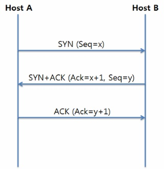
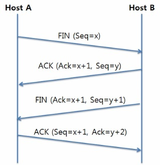

# TCP 3, 4-way handshake

## TCP 헤더

- TCP 헤더의 flag bit(code bit, control bit)
    - `ACK` : 상대방으로부터 패킷을 받았다는 것을 알려주는 패킷(클라이언트가 보낸 최초의 SYN 패킷 이후에 전송되는 모든 패킷에 ACK 플래그 비트가 1로 설정되어야 함)
    - `SYN` : 연결 설정 요구할 때 양쪽에서 최초로 보내는 패킷이다.(시퀀스 번호가 임의의 난수로 설정되어 세션 연결시 사용된다)
    - `FIN` : 세션 연결을 종료할 때 사용되는 패킷. 더 이상 전송할 데이터가 없을 때 연결 종료 의사 표시의 의미이다.
    

## TCP 3-way handshake

클라이언트와 서버가 패킷을 주고 받으며 TCP connection을 수립하는 과정이다.

1. 클라이언트(`SYN(x)`) → 서버
    
    클라이언트가 서버와 연결을 요청하는 의미로 SYN(x) 패킷을 보낸다. x는 Sequence Number로 **임의의 난수로 설정**되고 세션 연결시 사용된다
    
2. 서버(`SYN(y), ACK(x+1)`) → 클라이언트
    
    서버는 클라이언트로부터 받은 SYN(x) 패킷에 대한 응답으로 ACK(x+1)패킷과 함께 자신도 연결을 요청한다는 의미로 SYN(y) 패킷을 보낸다
    
3. 클라이언트(`ACK(y+1)`) → 서버
    
    클라이언트는 서버로부터 SYN(y), ACK(x+1) 패킷을 받고 이에 대한 응답으로 ACK(y+1) 패킷을 보낸다.
    

`초기 SYN 패킷의 Sequence Number(ISN)`가 임의의 난수로 설정되는 이유

- TCP connection을 맺을 때 사용되는 port의 범위가 유한하다. 다시말해 포트 번호가 재사용되기 때문에 과거에 사용된 “포트 번호 쌍”이 재사용될 수 있다.
- 서버는 클라이언트가 보낸 SYN 패킷의 Sequence Number를 보고 패킷을 구분하는데, 만약 ISN을 0부터 순차적으로 설정하면 해당 패킷이 이전 connection으로부터 전송된 패킷인지 현재 connection으로부터 전송된 패킷인지 알 수 없다.
- 위와 같은 가능성을 줄이고자 ISN을 임의의 난수로 설정한다.

## TCP 4-way handshake

TCP connection을 해제하는 과정이다.

1. 클라이언트(`FIN(x)`) → 서버
    
    클라이언트는 서버와 TCP connection을 해제하겠다는 의미로 FIN(x) 패킷을 전송한다
    
2. 서버(`ACK(x+1, y)`) → 클라이언트
    
    서버는 클라이언트의 FIN(x) 패킷에 대한 응답으로 ACK(x+1, y) 패킷을 보낸다. 그리고 나서 서버는 미처 전송하지 못한 패킷들을 전송한다. 
    
    - ACK 패킷의 Acknowledge Number는 x+1이고 Sequence Number는 y이다
3. 서버(`FIN(x+1, y+1)`) → 클라이언트
    
    서버가 패킷들을 모두 전송하면 클라이언트와 TCP connection을 해제하겠다는 의미로 FIN(x+1, y+1) 패킷을 보낸다.
    
    - FIN 패킷의 Acknowledge Number는 x+1이고 Sequence Number는 y+1이다
4. 클라이언트(`ACK(y+2, x+1)`) → 서버
    
    클라이언트는 서버의 FIN 패킷에 대한 응답으로 ACK(y+2, x+1) 패킷을 보낸다.
    
    - ACK 패킷의 Acknowledge Number는 y+2이고 Sequence Number는 x+1이다

`TCP connection 해제 단계는 연결 수립 단계보다 한 단계 더 많을까?`

- 클라이언트가 데이터 전송을 마쳐 connection을 해제하고 싶어도, 서버에서 아직 보내지 못한 잉여 패킷이 존재할 수 있기 때문이다.
- 따라서 `(1) 서버는 클라이언트의 FIN 패킷에 대한 응답으로 ACK 패킷을 보내고` → `(2) 잉여 패킷을 모두 전송한 뒤에 FIN 패킷을 보내`기 때문에 한 단계가 더 많다.

`TCP connection 해제 과정에서 서버가 전송한 패킷이 FIN 패킷보다 늦게 클라이언트에 도착하면 어떻게 될까?`

- 세션이 종료된 이후 클라이언트에 도착한 패킷은 drop되어 데이터가 유실된다.
- 이를 막기 위해 클라이언트는 서버로부터 FIN 패킷을 받고 일정시간(default 240s)동안 세션을 유지하여 잉여 패킷을 기다린다. 이와 같은 상태를 `TIME_WAIT`라 한다.