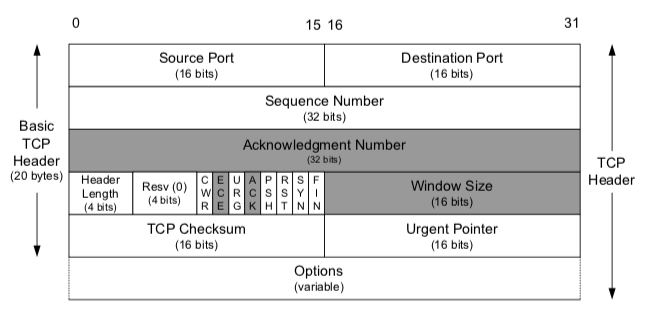

# TCP와 UDP의 차이점 + QUIC

## 전송계층의 필요성

1,2,3 계층만으로도 목적지 장치에 데이터를 전달할 수 있음에도 전송계층(TCP, UDP)이 필요한 이유

1. IP 프로토콜은 장치에서 장치로 즉, `host to host의 데이터 전송만 지원`한다. → 장치 속 수많은 어플리케이션들과 통신할 경우 한계가 있다 (port의 필요성)
2. IP 프로토콜로 데이터 전송 시 `오류가 발생하면 이를 대처하지 못한다`. (ICMP로 오류를 알려줄 뿐 대처 못함) → 신뢰성있는 데이터 전송의 필요성

전송 계층에는 `오류 검증` 기능을 통해 신뢰성 있는 데이터 전송을 보장하고 `port` 개념으로 목적지 장치 속 어플리케이션을 식별할 수 있다.

## 전송 계층의 통신 종류

|  | 연결형 통신 | 비연결형 통신 |
| --- | --- | --- |
| 특징 | 신뢰성 | 효율성 |
| 정의 | 신뢰할 수 있는 데이터를 전달하는 통신 | 효율적으로 데이터를 전달하는 통신 |
| 데이터 전송 과정 | 연결 설정을 요구하고 승인하는 과정을 거친 뒤에 데이터를 전송 | 연결 설정에 대한 확인 절차 없이 일방적으로 데이터를 전송 |
| 사용되는 곳 | 데이터의 신뢰성이 요구되는 서비스에서 사용된다. | 데이터의 빠른 전송이 요구되는 동영상 송출 서비스에서 사용된다 |
| 전송계층의 프로토콜 | TCP: 전송 계층의 연결형 통신 프로토콜 | UDP: 전송 계층의 비연결형 통신 프로토콜 |

## TCP

장치들 사이에 논리적인 가상 회로를 수립하여 `신뢰성있는 데이터 전달을 보장`하는 `연결형` 통신 프로토콜

- 신뢰성 보장을 위해 체크해야할 문제들 : `손실 문제, 순서 뒤바뀜 문제, 네트워크 혼잡 문제, 오버로드 문제`
- 신뢰성 보장을 위해 해야할 것 : `흐름제어, 혼잡제어, 오류 제어(데이터 재전송)`

### TCP 헤더

`Sequence Number, Acknowledgement Number, Flag Bit`

- 데이터 교환 및 재전송에 사용되는 TCP 헤더 필드
    - Sequence Number : 송신측이 보낸 데이터의 순서를 나타냄
    - Acknowledgement Number : 수신측이 받은 데이터의 순서

`Window Size`

- 세그먼트를 연속으로 보내기 위해 활용되는 TCP 헤더 필드
    - 수신측 버퍼 오버 플로우를 방지하기 위해 송신측에서 수신측 버퍼의 한계 크기를 알아야 한다.
    - 3-way handshake 과정에서 Window Size 필드를 통해 수신측 버퍼의 크기를 알 수 있다.

`Source Port, Destination Port`

- 데이터의 목적지 정보를 나타내는 TCP 헤더 필드
    - 0 ~ 65535가 포트번호로 사용된다

### 특징

- `연결형 통신 프로토콜로서 가상 회선 방식을 제공한다`
- `흐름 제어 기능을 제공한다`
- `혼잡 제어 기능을 제공한다`
- `오류 제어 기능을 제공한다`
- `점이중, 점대점 방식이다`