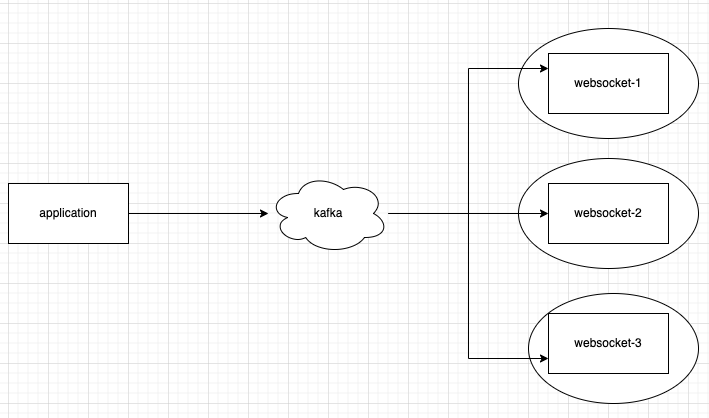

# 웹소켓 메시지 퍼블리싱

## 상황

* websocket 서버와 application 서버가 여러 대 존재
* 유저A 가 1번 websocket 서버에 연결
* application 서버에서 유저A에게 특정하여 메시지를 publish 하려고 함

## 1. kafka를 통한 메시지 publish

우리 팀은 초반에 웹소켓 메시지를 유저에게 보내기 위해 미들웨어로 kafka를 사용했었다.

<figure><figcaption></figcaption></figure>

* 메시지 publish 요청 메시지를 관리하는 kafka topic 1개가 존재한다.
* 각 웹소켓 서버는 consumer로써 topic에 대한 메시지를 읽어 웹소켓 메시지 publish를 수행한다.
* 당시 아키텍처로 특정 유저가 어떤 웹소켓 서버에 연결되어 있는지 알 수 없었기에 모든 consumer(웹소켓 서버)가 topic의 메시지를 소비해야 했다.

위와 같은 상황으로 인해 문제점들이 생겼다.

1. 웹소켓 서버들을 하나의 consumer group으로 묶을 수 없다.

같은 group의 속한 consumer들은 topic의 다른 파티션의 메시지를 소비하므로, 같은 파티션의 메시지를 소비할 수 없다.

결국 웹소켓 서버 1개를 하나의 consumer group으로 정의하였다.

2. 여러 consumer들이 하나의 파티션을 소비하려고 하는 경합으로 인한 성능저하가 발생한다

## 2. redis pub/sub을 통한 메시지 publish

